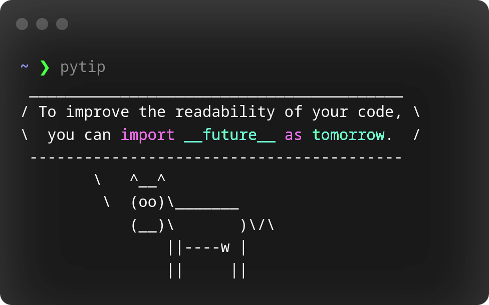

<!-- 
 
 -->

<!-- Typing Text -->
<!-- https://readme-typing-svg.demolab.com/demo/ -->

<!-- Begin header section
 -->

 

  
  
  

<!-- End of header section -->
 
 

<h2 align = "center" style="color:#20F7B7"> / about-me /</h2>

> I'm curious, enthusiastic and student most of the time, like the rest of the time to write code, especially in Javascript.

> A Tip:
>  

  
<h2 align = "center" style="color:#20F7B7"> / current-skills /</h2>

<!-- - <h4> languages </h4>
  

  
  

  - <h5> currently learning </h5>
    
    

- <h4> frameworks & libraries </h4>
  
  
  
  

- <h4> designing tools </h4>
  
  
  

     -->

  

 

<h2>🛠️ Tools</h2>
  <!-- Some badges are from https://github.com/Ileriayo/markdown-badges -->

  <h3>👨‍💻 Programming and Markup Languages</h3>

  

      <!--  -->
      
      
      <!--  -->
      <!--  -->
      <!--  -->
      
      <!--  -->
      
      
      
      <!--  -->
      <!--  -->
      <!--  -->
      <!--  -->
      <!--  -->
      
      <!--  -->
      <!--  -->
      <!--  -->
      
      <!-- 
       -->
  

  <h3>🧰 Frameworks and Libraries</h3>

  

      <!-- 
       -->
      
      <!-- 
       -->
      <!--  -->
      <!--  -->
      
      <!--  -->
      <!--  -->
      <!--  -->
      <!--  -->
      <!--  -->
      
      
      <!--  -->
      <!--  -->
      <!--  -->
      <!--  -->
      <!--  -->
      <!--  -->
      <!--  -->
      <!--  -->
      
      <!--  -->
      
      

  

  <h3>🗄️ Databases and Cloud Hosting</h3>

  

      
      
      <!--  -->
      
      <!--  -->
      <!--  -->
      <!--  -->
      <!--  -->
      <!--  -->
      
      <!--  -->
  

  <h3>💻 Software and Tools</h3>

  

      
      
      <!--  -->
      <!--  -->
      <!--  -->
      <!--  -->
      <!--  -->
      <!--  -->
      <!--  -->
      <!--  -->
      
      
      
      
      <!--  -->
      <!--  -->
      
      <!--  -->
      <!--  -->
      <!--  -->
      
      
      
      
      
      

  

---
